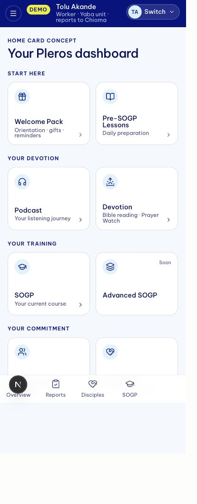

# Dashboard home: compact vertical cards and consolidation

9 October 2026. Mobbin desktop and iOS screen searches were performed through the connected MCP. Returned low-resolution screen images were inspected; this is screen research, not a claim to have tested complete reference flows.

## Recommendation

Keep one `/dashboard` Home: the personal launcher plus a compact, real-data Today summary when useful. Keep compact vertical cards: icon above title, a short metadata line below, and a quiet arrow. Bring reporting and oversight into the same app shell, with navigation appropriate to the authenticated person's actual permissions.

The biggest current layout issue is measurable in source: `WelcomeDashboardView` caps both hero and content at `36rem`, renders a `15rem` desktop hero and stacks four two-card sections. This leaves desktop width unused and pushes useful cards down. Preserve the sections and cards, but arrange two sections side by side on wide desktop (four card columns total), with two card columns on tablet and mobile. Use a compact greeting in place of the large hero.

## References actually inspected

| Reference | Useful observation | Application |
| --- | --- | --- |
| [Frame grouped home tiles](https://mobbin.com/screens/bf0e3ae2-4b91-4cc6-a7b9-848dc509bfaf) · web | Grouped, compact white vertical tiles; small identifying icon at the top and label below | Primary card anatomy; preserve Pleros' vertical layout and familiar groupings |
| [ElevenLabs home](https://mobbin.com/screens/7fb06f1b-99ad-4007-9179-80701cde68bf) · web | A short greeting followed by distinct product-entry tiles | Strengthen feature identities through icons; reserve richer artwork for a genuine current-course feature |
| [Databricks welcome grid](https://mobbin.com/screens/fdf2e9f8-14e7-4470-a4e6-8c98aaa081b6) · web | Six entries in a tightly aligned grid, restrained borders and clear labels | Adopt its density and alignment while retaining vertical icon/title anatomy |
| [GitBook welcome screen](https://mobbin.com/screens/5926c0f1-beef-4822-a523-7ce65a9c188c) · web | Persistent navigation, compact shortcuts and clear section hierarchy | Unify navigation instead of creating another separate dashboard home |
| [Headway collections](https://mobbin.com/screens/e6b2eb5b-40ce-42b8-8e2b-e47f4548671c) · iOS | Two-up vertical cards grouped into recognizable sections | Keep two columns on phones; use restrained existing colour accents rather than large artwork |
| [Skillshare course cards](https://mobbin.com/screens/7819c5cf-d790-436c-8d8d-4b1d259e9676) · iOS | Course cover, title and compact lesson metadata | Optional richer SOGP continuation card, only with real content and progress data |

## Three card directions

1. **Compact vertical tiles — recommended.** White panels, 132px starting height, 14px titles, 11.5–12px metadata, a 19–20px outline icon in a 32px quiet blue chip, restrained border and one consistent arrow. Four columns on wide desktop; two on tablet/mobile. The review-only route `/preview/pleros/home-concept` demonstrates this with the existing eight home entries.
2. **Compact vertical tiles with section colour.** Same geometry; retain the current gold/blue/purple/green identity as a faint icon chip or border accent. Keep the card bodies calm. This is the closest visual evolution of the current home.
3. **One current-course card plus compact vertical tiles.** A slightly richer SOGP card may show the next teaching and actual progress; all other destinations stay compact. This makes sense once the real home adapter supplies current-course data. Avoid promotional or generic "coming soon" cards taking equal priority over daily actions.

Use one outline icon family, size and stroke throughout:

| Entry | Suggested Lucide icon |
| --- | --- |
| Welcome Pack | Gift |
| Pre-SOGP lessons | BookOpen |
| Podcast | Headphones |
| Devotion | Sunrise |
| SOGP | GraduationCap |
| Advanced SOGP | Layers, with a compact unavailable state |
| Community | Users |
| Partnership | HeartHandshake |

The review mock is visual only; its tiles are not wired to live resources. Production must retain `resolveWelcomeDashboardSections()` and its real access, countdown and destination rules. Enrolment-required, upcoming and coming-soon states must still be clear in the final card component.

## How this consolidates with the real dashboard

The current demo is a visual/interaction prototype, not another production identity system. Promote presentation components rather than copying its synthetic store into live routes.

1. Extract a shared `DashboardShell` and presentational navigation, header, card and count primitives. The preview adapter supplies synthetic person/scope data and its DEMO switcher. The production adapter supplies authenticated, server-authorized data and real account actions; it never accepts the demo's `as` parameter as identity.
2. Keep `/dashboard` as the personal home. Use the existing `getAppSession()`, display-name resolver, `getSogpDashboardAccess()` and `resolveWelcomeDashboardSections()` for its cards. Keep canonical URLs and access states. The current home resolver uses SOGP enrolment for Community too; assigned pastors can legitimately access Community without enrolment, so derive each feature flag from its own current guard (`getCommunityContext()` / `canAccessCommunity()`), not one SOGP boolean.
3. Let `/dashboard` layout host the common shell. Then integrate SOGP, Podcast, Prayer Watch, Welcome Pack and reporting a route at a time. SOGP and Podcast currently bypass the generic `AppShell`, so their old headers must be reconciled deliberately to avoid two navigation bars.
4. My disciples keeps the current named-group and ownership rules. Contacts remain owner-scoped within it. Church oversight navigation in production follows current permissions; the prototype's proposed hierarchy does not grant member-appointed leaders new ministry access.
5. Add durable category declarations, meeting roles and approved church roster/scope rules separately. Reuse canonical activities and compiled devotion. Reminder-only policy remains; cadence/channel are unapproved and no live reminder sends are activated by this work.

## Preview updates completed alongside this research

Blue direction retained; tablet/mobile sidebar drawer added; compact eyebrows rendered consistently; scope drill-down preserves the active viewer; full-scope rosters group by unit leader; parenthesized tab/disclosure counts became circular badges. Unit tests pin scope boundaries and deduplication.

