# QA and comparison evidence

9 October 2026. Branch `codex/authenticated-dashboard-demo`. Claude Opus 5.5 performed the code audit, Mobbin research and initial UI implementation through the CLI, then repaired browser findings. Its CLI session limit was reached during final reporting; Codex completed QA and the user's requested cleanup.

## Checks run

- Six focused test files: **55 tests passed**, including scope/privacy, reporting states, date limits, group rules, numeric roll-ups, runtime import isolation and the existing activity-form rules.
- Scoped ESLint passed, including the two shared form steps used in compact mode. Their defaults preserve existing live behavior.
- Full typecheck is blocked by five existing checkout/environment errors: missing installed `recharts` / `xlsx`, and a stale generated staff-route reference. No preview-source type errors. No production build or full-suite certification is claimed.
- Browser checks used desktop and mobile widths, with final geometry checks showing no horizontal overflow. The rendered body and heading faces resolve to **Be Vietnam Pro**, not Sen.

## Browser flows observed

- Worker: prefilled devotion → confirmation → direct Evangelism form → anonymous online reach 25 / saved 2 → explicit Nil meeting → complete full daily report. The result survived a hard reload.
- Invalid submit focuses the first invalid control; historical dates beyond today minus two stay view-only.
- Leader: the worker's status/numbers update from shared state; private test notes are absent. Missing-status filters and the local reminder queue work. Escape dismisses detail sheets and returns focus.
- Intermediate and Pastor scopes roll up consistent branch totals. Unique people are counted separately from roles/memberships. Each tier's own discipleship groups remain separate.
- Contacts now lives in My disciples: follow-up, invitation and explicit named-subject acceptance work; neither follow-up nor invitation creates membership. Arrow keys work across Groups / My group / Contacts.
- Paused, closed, empty and joined-group states were reached. Paused groups cannot rename, close, invite or create another group; closed links remain off.
- SOGP runs in the same shell. A lesson/quiz updates the same source Devotional reports reads; Prayer Watch source edits also reflect there.
- Reset clears a disposable declaration (1/3 → 0/3) and restores fixtures. Unsupported categories render a helpful not-found state.
- The fresh demo console was clean after hydration repairs; its DOM had no tracking scripts or external action links. Runtime import isolation remained green after cleanup.

## Resolved findings

The mixed reporting landing became three categories with explicit Nil and completeness. Redundant activity Next was removed. The launcher became role-aware Overview; shared navigation now uses Church oversight and My disciples. The user's cleanup removed explanatory/policy banners and switched typography to the public body face. Browser QA caught and resolved numeric/interaction-field collision, invalid breadcrumb nesting, missing mobile person names, crowded tracker marks, paused-group copy and embedded-browser native reset confirmation.

## Limits

Initial baseline discovery used existing synthetic Overview, SOGP and discipleship previews; a local session later made unchanged Reports, People and leader screens available for read-only supplemental captures. No real submissions or role changes were made. Available current roles were not impersonated. Earlier baseline viewport overrides were affected by browser zoom; final preview geometry was measured directly. A later matching-width authenticated baseline request timed out, so that extra capture is not claimed. Runtime exception-boundary rendering and a physical phone were not tested; validation errors, not-found, keyboard and mobile-width behavior were observed. Live hierarchy permissions, category declarations, meeting-role persistence and reminder policy remain backend gaps documented in README.

## Current cleanup screenshots

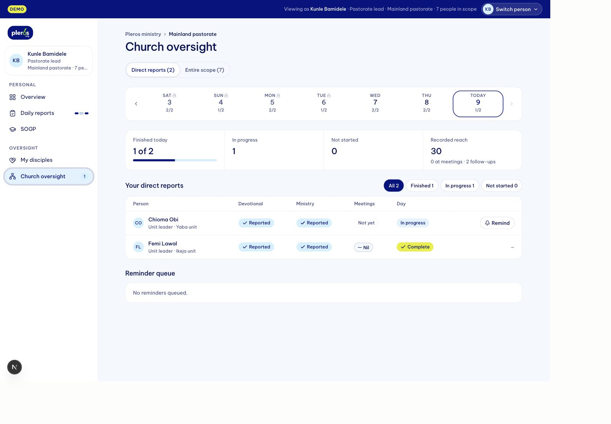

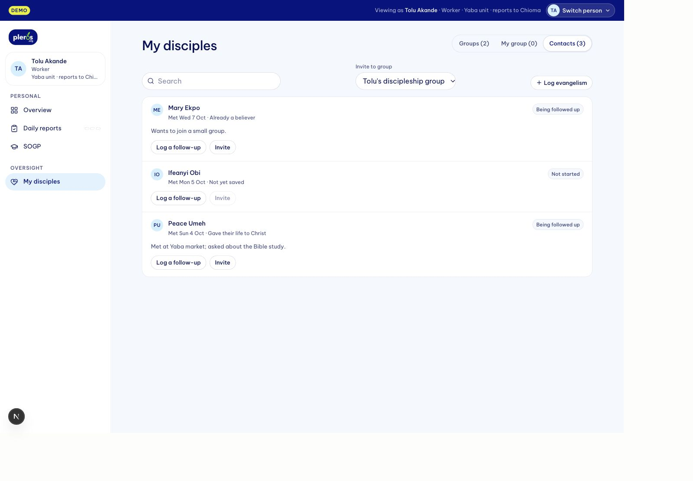

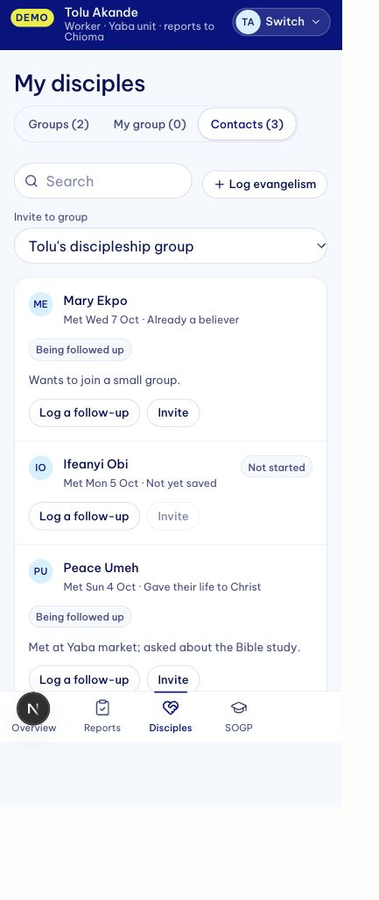

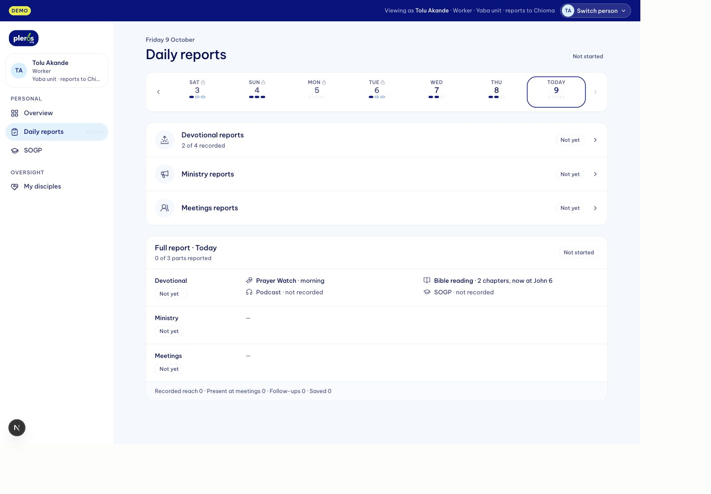

## Baseline and first redesign comparison

These capture the unchanged old interface and the first full prototype before the later copy/font/navigation cleanup. `clean-*` images above are the current design.

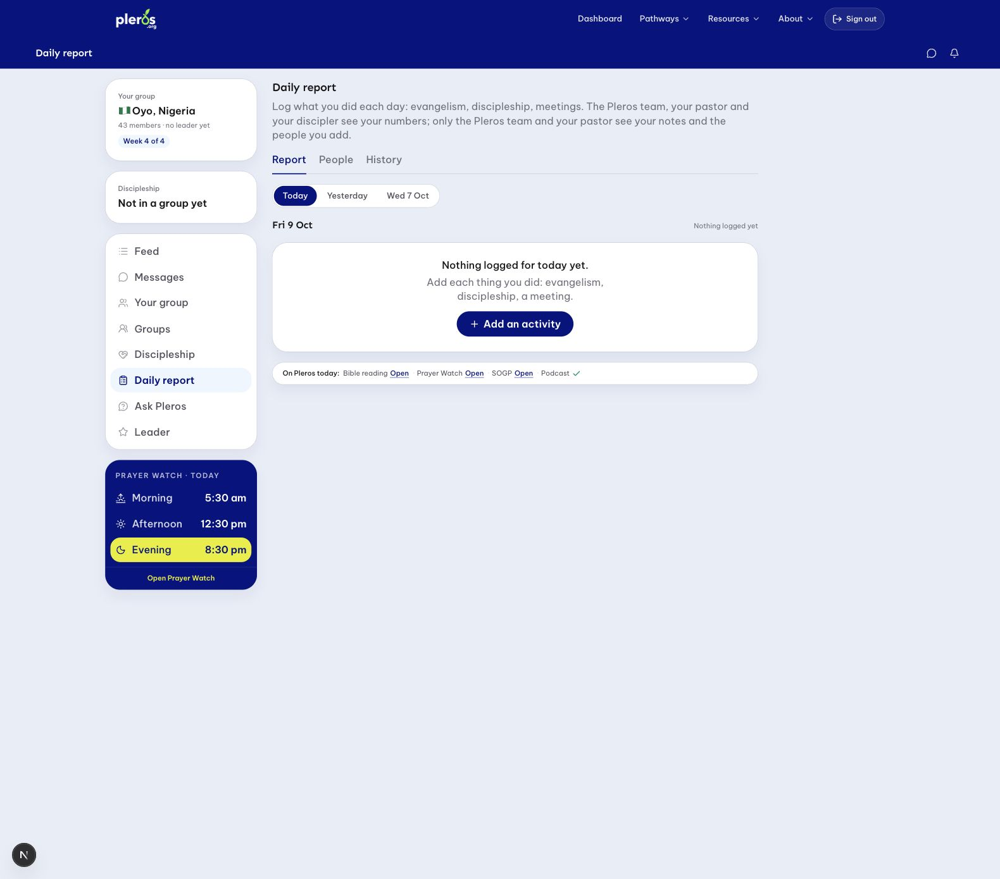

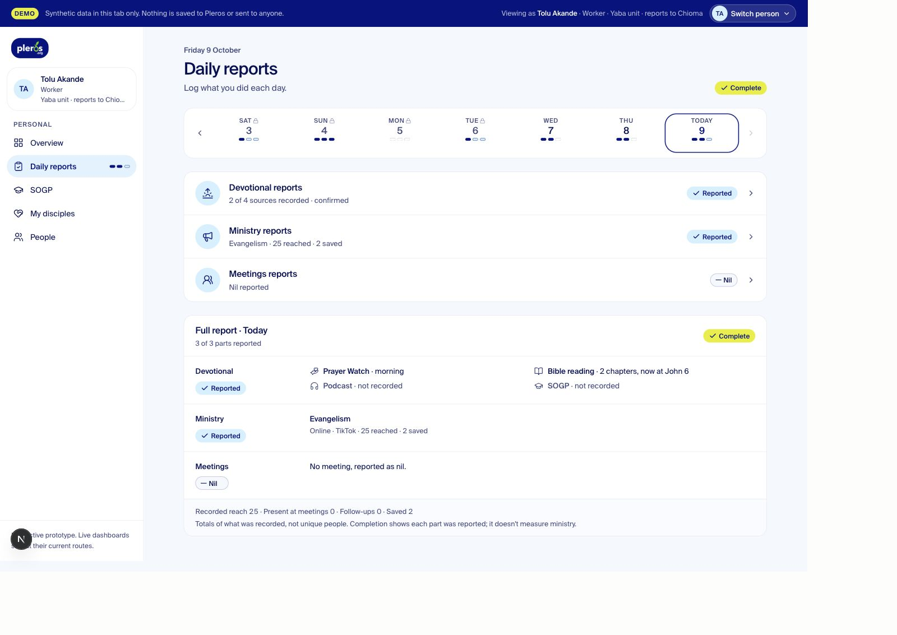

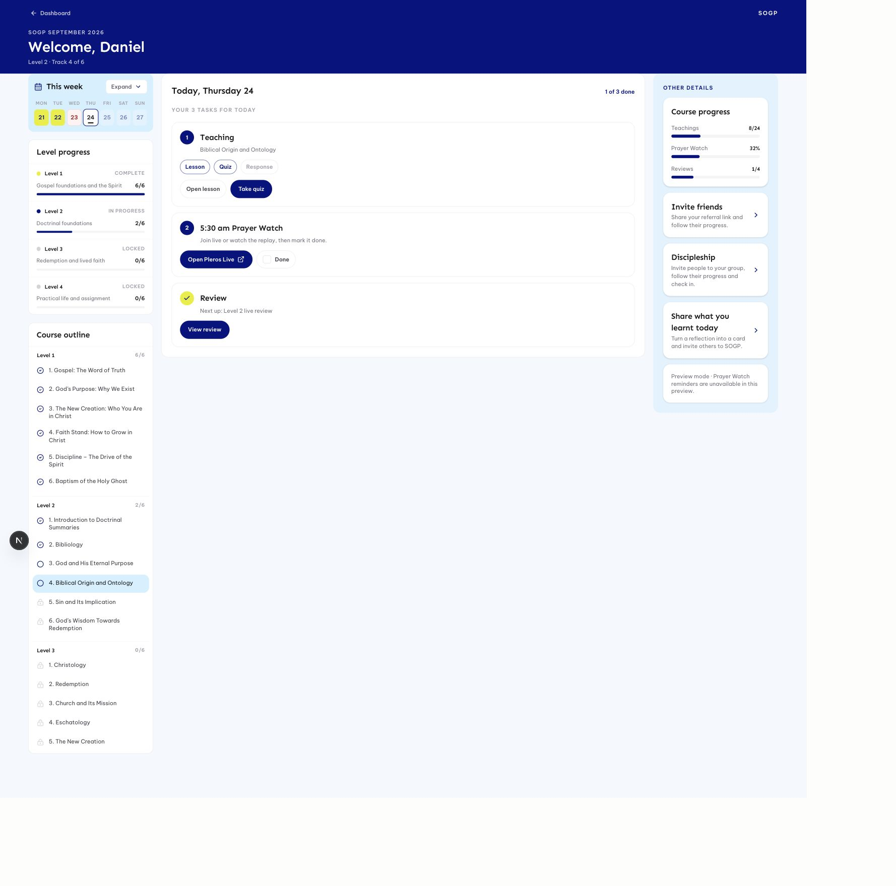

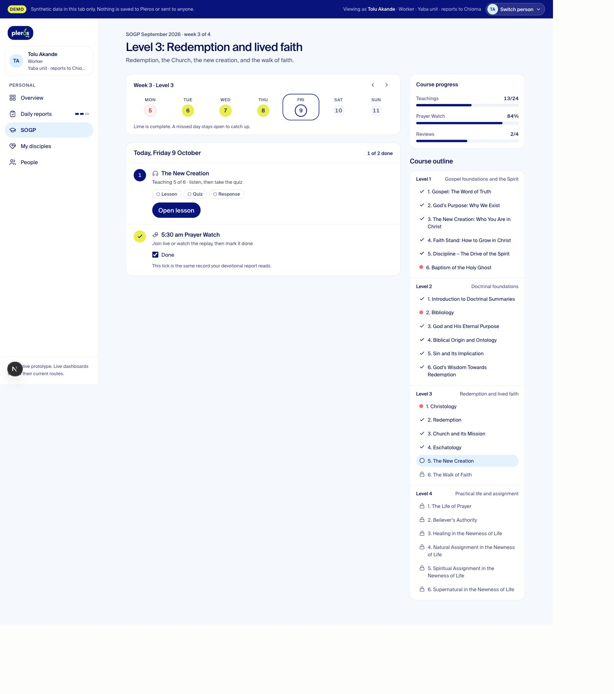

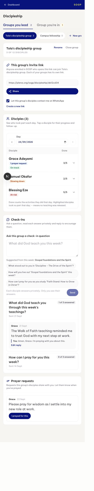

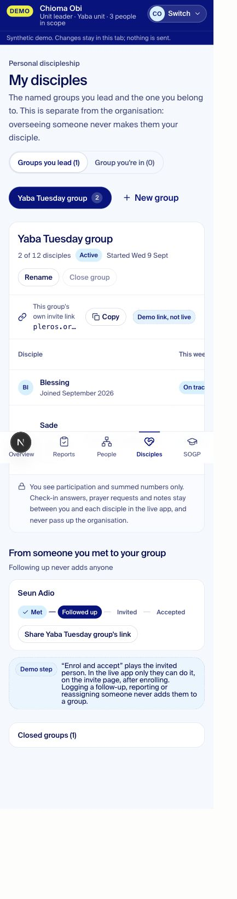

## Scope and responsive-navigation follow-up

57 focused tests passed across seven files, including new scope navigation and grouping tests. The latest import-isolation and scope tests also passed after adding the home concept. Scoped ESLint passed. Full typecheck still reports the same five pre-existing dependency/generated-route errors. Browser QA verified Kunle → Chioma drill-down without changing viewer, ancestor return links, unit-leader grouping, circle counts, styled eyebrows, native sidebar drawers at tablet/mobile widths and clean console on the home concept. The concept had no horizontal overflow at the measured 390px viewport. Production Home is still a proposal, not modified code.

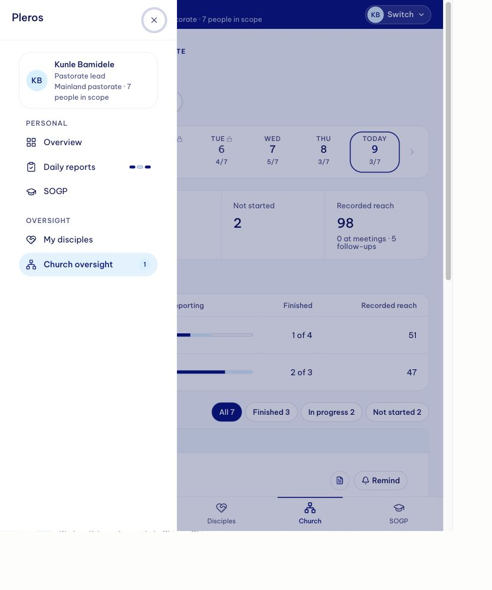

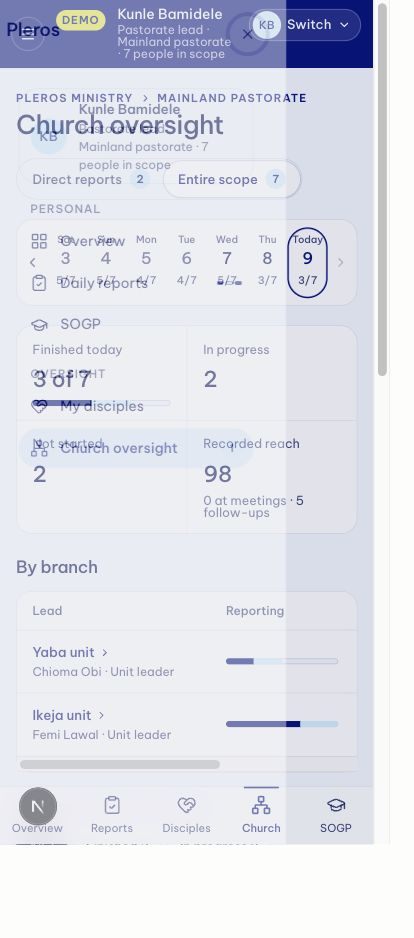

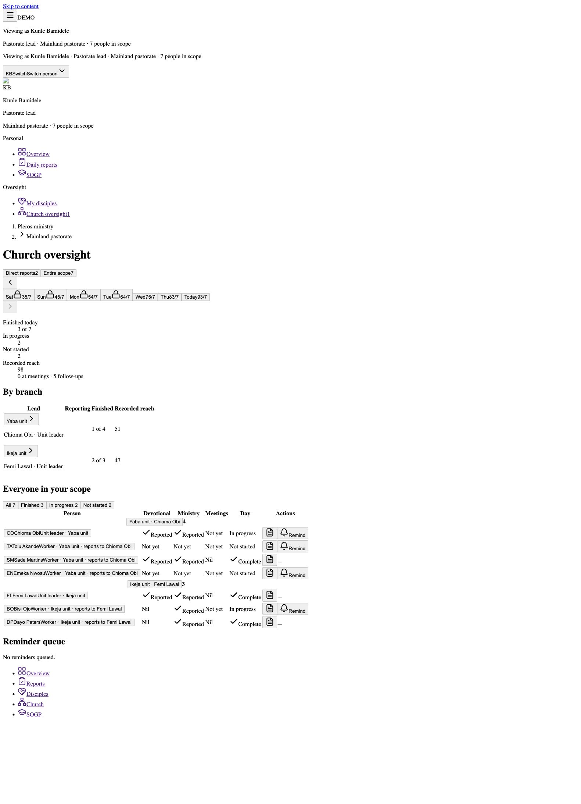

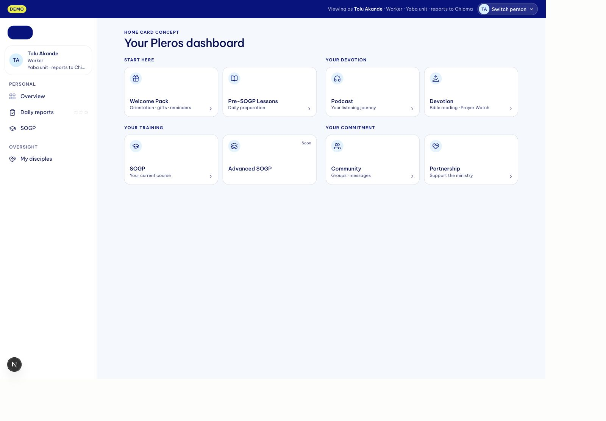

### Organized navigation follow-up

- Scoped ESLint passed for navigation, shell and destination view/route. Five import-isolation tests passed; `git diff --check` passed.
- Browser checked desktop inventory and mobile drawer: six grouped sections, profile header, keyboard Enter expansion, current section auto-open, Messages destination and retained `as=d-kemi`. Other existing destinations use the same explicit unavailable adapter rather than live dashboard routes.
- Screenshot: `screenshots/after-organized-navigation-mobile.jpg`.
- Full TypeScript check still reports only the five known missing-module/cache issues (stale admin staff route, recharts, and three xlsx references). No new navigation type errors reported.

### Mobile navigation hierarchy refinement

Scoped shell ESLint and all five import-isolation tests passed. Mobile browser checks confirmed zero child icons, exactly one expanded section after pointer and keyboard changes, five inert closed panels, and safe links retaining person/day. Screenshot: `screenshots/after-mobile-parent-navigation.jpg`. Reduced-motion CSS is present; an emulated reduced-motion check was not run.

### Vercel Preview delivery

Full remote build including TypeScript passed. All 57 focused tests and scoped ESLint passed locally. Authorized HTTP checks returned 200 and expected content for the five working preview views. Hosted browser QA reached Vercel Authentication rather than the app, so hosted interactions were not rechecked. Explicit upload exclusions were manifest-checked; the first superseded attempt was removed. See `DEPLOYMENT.md`.

### Profile and Today follow-up

Daily reports now uses the same brand-lime Today highlight as Overview (verified computed background and thin selected border). Drawer-header Profile settings navigation opened the isolated route and closed the drawer. A synthetic name edit updated the top-bar name; Reset password remained disabled and marked Not connected. Scoped ESLint and 22 store/isolation tests passed. Native photo selection was not browser-tested; store validation rejects external image URLs. Screenshots: `after-reports-today-lime.jpg`, `after-profile-settings-mobile.jpg`. These changes have not been redeployed.

### Consolidation checkpoint

156 focused tests/21 files and scoped lint pass. Only the five known full-TypeScript environment/cache errors remain. Actual shared home body was rendered with synthetic props at mobile/desktop widths; title21px, two mobile columns, no overflow or live URLs. The production authenticated shell/data/account actions have not been browser-verified with a populated isolated session. Generated migration0050 is unapplied, V2 gate disabled, reminder planner sends nothing. See `CONSOLIDATION-IMPLEMENTATION.md`.
